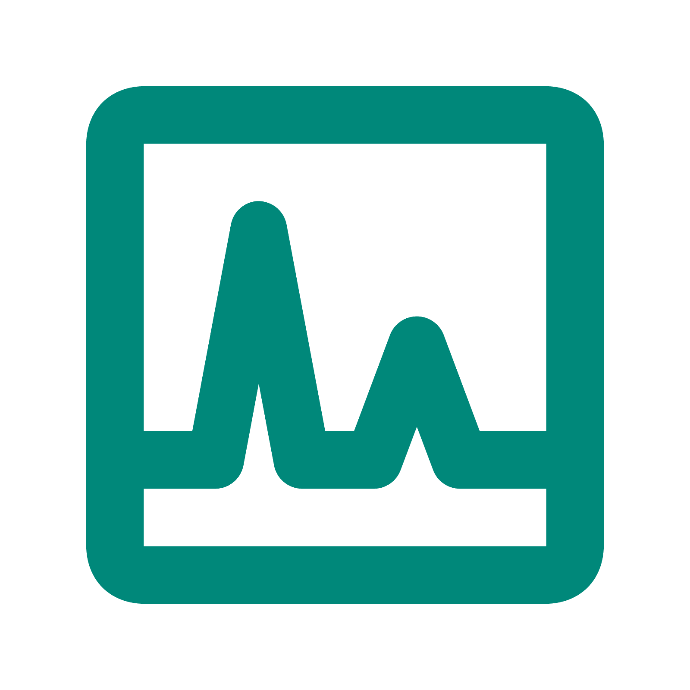

# IFMap

### Template de Testes

### Logo do Projeto

### Descrição
O IFMap é um sistema que busca fazer uma mapeação do IFRN, com o objetivo de 
guiar usuarios para determinados locais.

# Tecnologias Utilizadas no Desenvolvimento

- Figma
- Django
- Github
- Python
- Canvas 
- Photopea
- VSCode
- Draw.IO
- Astah

# Guia do Desenvolvedor

[LINK para o guia do desenvolvedor do projeto IFMap](./docs/desenvolvedor/guia_desenvolvedor.md).

# Canais de Comunicação

- Dicord
- Whatsapp

# Membros 

- Alice de Lima Silva
- Giovanna Batista de Melo 
- Joana Darc Fernandes Silva
- Manrick Lázaro dos Santos Silva
- Matheus Arthur Lúcio da Rocha 
- Tiago de Assunção Cruz 
- Virginia Claudia de Lima Menezes 